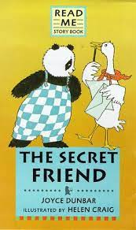

# Secret Friend game

### **What is the secret friend game?**

#### Normally in school days we play a game like A group comes together, everyone writes down their name on a piece of paper, and each participant draws a random name out of a box. You are the Secret friend for the person you draw. At the end of the game you write down a gift suggestion or two on a wish list and your Secret friend chooses a gift for you from that list. In the middle of the game everyone play some funny tasks and dares . Fianlly at the end you have to find your secret friend with some hints and puzzles.

#### We come up with this idea at the end of our bachelor technology in 2020 covid strikes badly and everyone got locked at a home. We felt bored and to have some fun with our friends start searching for some platforms where we have some fun and save some memories at the end. 

#### Then finally we decided instead of looking for some other platform. We start building our own web platform using Django framework. We simply try to mimic the same secret friend concept for the simplicty and easily to access for everyone we design it with mobileview.

#### we design,deploy and use the same webisite for playing this game. If you want you can explore by using below link, Sample credentials of mine Roll Number : 316177112032 & Password : whg8tlgd   

[Secret Friend](https://saikrish32.pythonanywhere.com)

